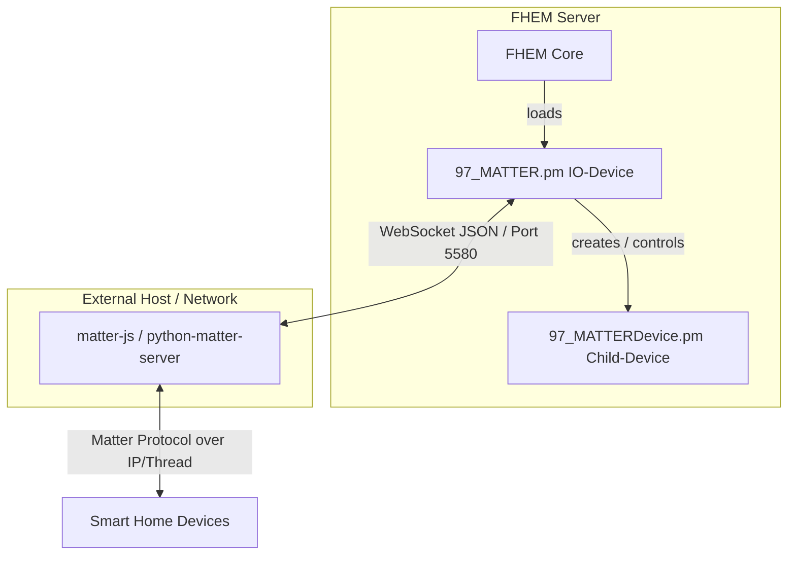

# FHEM Matter Integration (`MATTER` & `MATTERDevice`)

This repository provides custom FHEM modules to integrate **Matter** smart home devices via a central WebSocket-based Matter server. 

The architecture consists of two modules:

1. **`97_MATTER.pm` (IO-Device):** Manages the raw TCP/WebSocket connection to the Matter server, handles handshakes, keeps-alives, and routes messages.
2. **`97_MATTERDevice.pm` (Child-Device):** Represents individual Matter nodes (e.g., lights, switches), dynamically adapts its controls based on supported clusters, and synchronizes states.

---

## Architecture Overview



---

## Prerequisites

Before setting up the FHEM modules, you need a running instance of a compatible Matter server that provides a WebSocket API, such as:

* matter-js/matterjs-server (or similar Python/Node.js based Matter controllers).

Make sure your Matter server is up and running and reachable via IP and port (default: 5580).

---

## Features

* **WebSocket Communication:** Native raw-socket handling with automatic handshake and JSON payload exchange.
* **Auto-Discovery:** Automatically queries the Matter server for nodes and creates corresponding FHEM devices (`MATTERDevice`).
* **Device Commissioning:** Add new network-connected devices directly via manual pairing codes from FHEM.
* **Dynamic Set-Lists:** Automatically detects device capabilities (OnOff, LevelControl, ColorControl/CT/RGB) and adjusts FHEM's `set` options and sliders accordingly.
* **Auto-Reconnect:** Built-in resilient connection recovery with safe interval timers.
* **FHEM Updater Support:** Seamless integration into the FHEM update mechanism.

---

## Installation & Setup

### 1. Add the Repository to FHEM
Open your FHEM command line and add this repository to your update sources:

```text
update add https://gitlab.com/zeppelin1979/fhem-matter/-/raw/main/controls_matter.txt
```

### 2. Install the Modules

Run the FHEM update command to download the files:

```text
update
```

(Restart FHEM afterward if required).

## Usage

### 1. Define the IO-Device

Connect to your local Matter server (default port is usually 5580):

```text
define matterServer MATTER <IP_ADDRESS> 5580
```

### 2. Commission a New Device (Optional)

If you have a new device prepared in your local network (e.g., via manufacturer app), you can commission it using its manual setup/pairing code:

```text
set matterServer commissionCode 35325335079
```

### 3. Discover Nodes

Trigger the discovery to automatically fetch and create all paired Matter devices from your server:

```text
set matterServer discover
```

### 4. Control Devices

Once created, individual `MATTERDevice` instances will appear. You can control them using standard FHEM commands depending on their capabilities:

* `set <device> on / off`
* `set <device> brightness <value>`
* `set <device> ct <mireds>`
* `set <device> rgb <hex>`
* `set <device> getConfig` (Forces synchronization of all attributes)

---

## Attributes

### MATTER IO-Device

* disable: Temporarily disable the connection (0/1).

### MATTERDevice (Child)

* `has_onoff`, `has_level`, `has_ct`, `has_hue`, `has_saturation`, `has_xy`: Feature flags (automatically managed during discovery/getConfig).
* `max_level`, `color_temp_min`, `color_temp_max`: Limits for sliders and color pickers.

---

## Open Issues:

* Only one endpoint is supported, devices witrh multiple endpoints won't work so far
* Commissioning via Bluetooth not realiezed so far
* Window Covering (Shutters) are included but not tested
* Door locks are not supported
* Thermostats are not supported

---

## License

This project is open-source and provided under the MIT License.